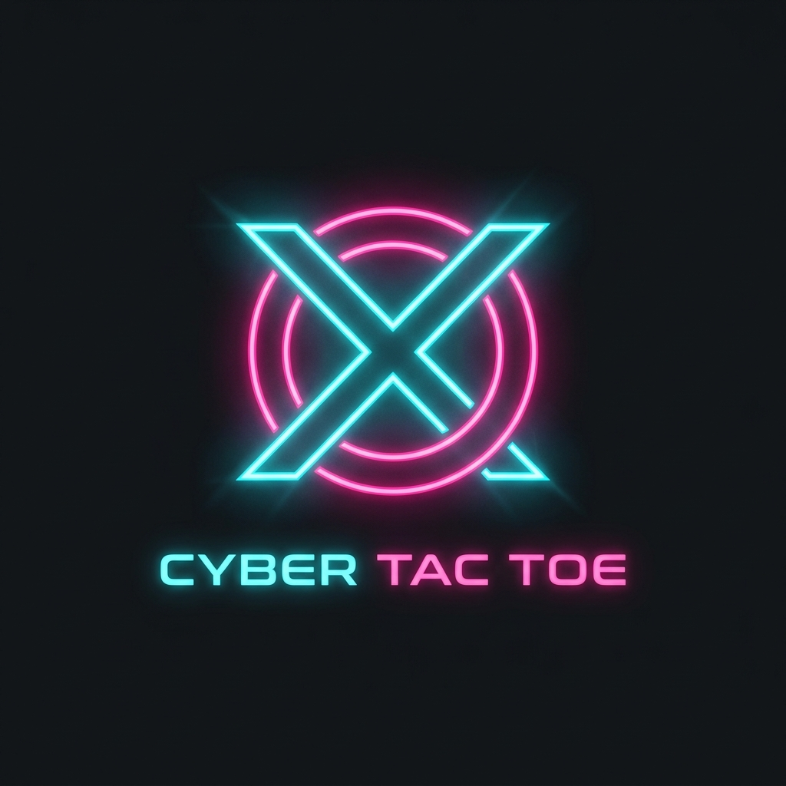

<div align="center">
  
  <h1>Magical Multiplayer Tic-Tac-Toe</h1>
</div>

A next-generation, highly interactive Tic-Tac-Toe contest built with React, TypeScript, Vite, and Socket.io.

## Features
- **Next-Gen Cyber Theme:** Ultra-dark solid background paired with high-contrast glowing neon accents (`#00f0ff` Cyan and `#ff0055` Pink).
- **Local & Online Modes:** Instantly play on the same screen, or host a server to generate a Room ID for remote play.
- **Contest Mechanics:** Host a "Best of 1, 3, 5, or 7" series. The game tracks matches and mathematically guarantees early victories if a player gains an unassailable lead.
- **Auto-Reset:** A smart 2-second freeze on victory ensures players can process the winning move before the board automatically resets.
- **Series Champion Overlay:** A massive, animated overlay takes over the screen to declare the ultimate winner or if the series ends in a draw.

## Installation

Ensure you have `Node.js` and `pnpm` installed.

1. Install frontend dependencies:
   ```bash
   pnpm install
   ```
2. Install backend dependencies:
   ```bash
   cd server
   pnpm install
   ```

---

## How to Play

You must have **both** the backend and frontend running to play, even for local matches.

**Start the Backend:**
```bash
cd server
node index.js
```

**Start the Frontend:**
```bash
pnpm run dev
```

You now have three ways to enjoy the game:

### Method 1: Local Play (Same PC)
1. Open your browser and navigate to `http://localhost:5173`.
2. Ensure the top toggle is set to **Local**.
3. Select your Contest Size and play directly on the same screen.

### Method 2: Mobile / Same Wi-Fi Network
If you want to play against someone sitting next to you on their own phone or laptop connected to the **same Wi-Fi router**:

1. Stop your frontend server (`Ctrl+C`).
2. Restart it with the host flag to expose it to your local network:
   ```bash
   pnpm run dev --host
   ```
3. Vite will output a "Network" IP address (e.g., `http://192.168.1.5:5173`).
4. Keep the backend running normally (`node index.js`).
5. Open your PC browser to `http://localhost:5173` and click **Online** -> **Host Match**.
6. Have your friend open the Network IP (e.g., `http://192.168.1.5:5173`) on their phone browser.
7. They click **Online** -> **Join Match** and enter the Room ID you generated!

### Method 3: Remote Play (Different PC / Anywhere in the World)
If you want to play with a friend living in a different city, you must expose both your local frontend and backend to the public internet. The easiest free way is using **LocalTunnel**.

1. **Expose the Backend:** Open a new terminal and run:
   ```bash
   npx localtunnel --port 3001
   ```
   *This generates a public URL (e.g., `https://my-backend.loca.lt`).*

2. **Update the App:** Go into `src/App.tsx` and change `SOCKET_URL` to match that new backend URL.

3. **Expose the Frontend:** Open another new terminal and run:
   ```bash
   npx localtunnel --port 5173
   ```
   *This generates a public URL for your game (e.g., `https://my-game.loca.lt`).*

4. Send the frontend link (`https://my-game.loca.lt`) and your Room ID to your friend. They can join from anywhere!
